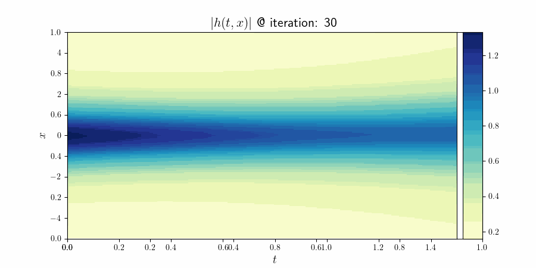
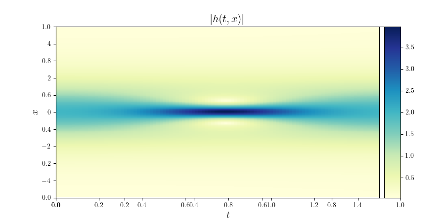

# Schrödinger 方程 PINN 求解器（Python）

本项目提供一个基于 **物理信息神经网络（PINN）** 的数值方法，用于求解一维 **非线性 Schrödinger 方程（NLS）**。学生可直接运行：

```
python main.py
```

即可训练模型。

---

## 📌 1. 功能简介

本代码使用 Physics-Informed Neural Networks（PINNs）方法，通过最小化 PDE、初值、边界条件的损失来求解以下非线性 Schrödinger 方程：

\[
i h_t = -frac{1}{2} h_{xx} + |h|^2 h
\]

其中：

- 输入：空间 \(x\)、时间 \(t\)
- 输出：实部 \(u(x,t)\)、虚部 \(v(x,t)\)
- 使用 LHS（Latin Hypercube Sampling）生成内部点
- 优化器：L-BFGS（强 Wolfe 搜索）

---

## 📂 2. 项目结构

```
.
├── main.py                         # 主程序（你提供的代码）
├── data/
│   └── NLS.mat                     # 训练数据（初值/边界）
├── Schrodingers_Equation/
│   └── models/                     # 模型存储目录
│       ├── model_LBFGS_xx.pt       
└── README.md                       # 本文档
```

---

## ⚙️ 3. 环境依赖

建议使用 Python 3.9–3.10。

### Conda 快速安装：

```
conda create -n pinn python=3.10
conda activate pinn

pip install torch numpy scipy pyDOE
```

若要使用 GPU，请安装支持 CUDA 的 PyTorch 版本。

---

## ▶️ 4. 运行教程

确保数据 `NLS.mat` 已放在 `./data/` 下。

### 直接运行：

```
python main.py
```

程序将自动：

1. 设置随机种子确保可复现性  
2. 读取 NLS 初始条件数据  
3. 构建 PINN 神经网络  
4. 生成 collocation 点  
5. 使用 L-BFGS 训练模型  
6. 自动保存模型参数  

---

## 🧠 5. 代码说明（核心部分）

### ✔️ 神经网络结构

- 输入维度：2（x, t）
- 隐层：5 层，每层 100 neurons
- 激活函数：Tanh
- 输出：2（u, v）

### ✔️ 损失函数组成

损失由以下三部分组成：

\[
	ext{loss} = MSE_f + MSE_0 + MSE_b
\]

对应：

- **PDE 约束**：内部点
- **初值约束**：t = 0
- **边界约束**：x = -5 与 x = 5

### ✔️ 使用 L-BFGS 训练

采用 PyTorch 内置的 L-BFGS 优化器，该方法适合 PINN 的强约束问题。

---

## 💾 6. 模型保存

训练过程中：

- 每 30 次迭代保存一次模型：
  ```
  Schrodingers_Equation/models/model_LBFGS_30.pt
  ```
- 最终模型保存为：
  ```
  Schrodingers_Equation/models/model_LBFGS.pt
  ```

---

## 📈 7. 结果可视化（可选）

训练完成后，你可以加载模型并自行绘制：

```python
model.load_state_dict(torch.load("Schrodingers_Equation/models/model_LBFGS.pt"))
```
|        Convergence animation   | LBFGS, 6.9k, Loss 1.47e-5 |
|:----------:|:-------------:|
|||
---

## 🙋‍♂️ 8. 常见问题

### Q：程序报错 “FileNotFoundError: data/NLS.mat not found”？

请确认你的数据目录结构为：

```
/data/NLS.mat
```

### Q：训练太慢？

- 尝试减少 `N_f`（内部点数量）
- 使用 GPU 加速（如果可用）

## 📚 九、引用
1, Raissi, M., Perdikaris, P., and Karniadakis, G. E. 2019. Physics-Informed Neural Networks: A Deep Learning Framework for Solving Forward and Inverse Problems Involving Nonlinear Partial Differential Equations. Journal of Computational Physics 378, 686–707. DOI: https://doi.org/10.1016/j.jcp.2018.10.045

2, E., Hamdi, and I., Zhang. PINN Pytorch Implementation. https://github.com/erfanhamdi/pinn-torch
