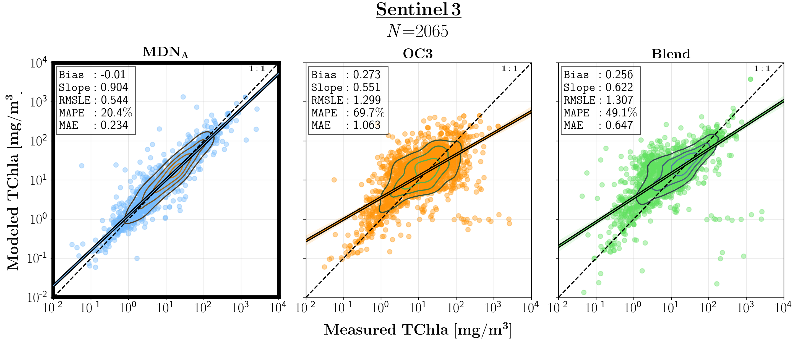
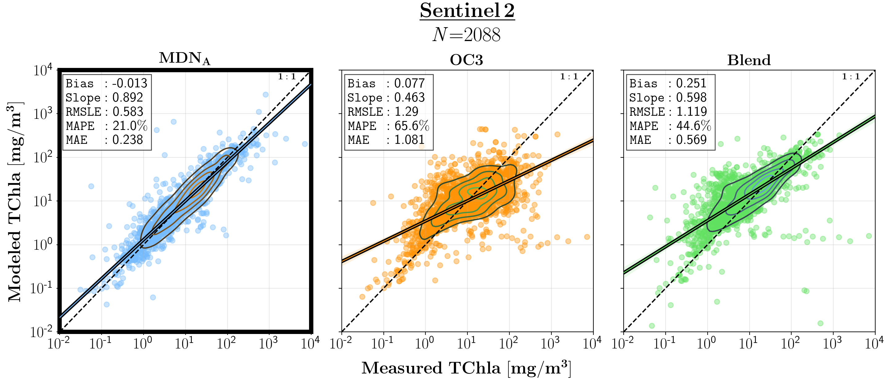
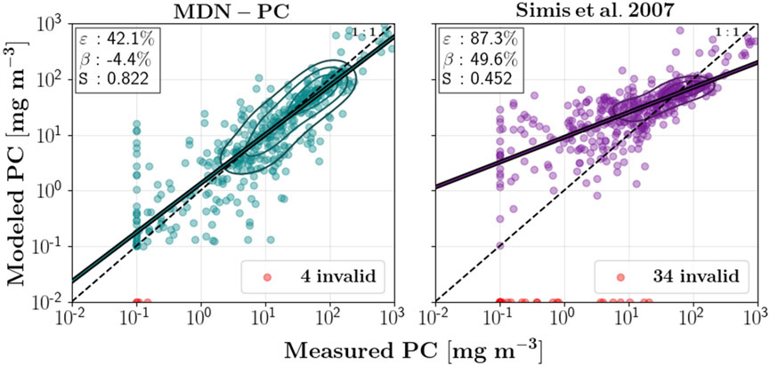

# 🌊 MDN_V2 水色参数反演模型
本项目提供一个基于MDN神经网络方法集合的海洋水色参数反演模型，用于结合相关的卫星观测数据，求解生物光学模型，
进而反演叶绿素浓度，CDOM等相关物质。

学生基于环境配置完成后，可直接运行：python test_MDN.py来进行模拟

# 1、功能介绍
该项目是一个用于水体遥感相关水质参数反演的代码仓库，主要针对内陆和近岸水域，可从卫星传感器数据中估计多种水质产品，
包括叶绿素 - a（chl）、总悬浮固体（tss）、有色可溶性有机物（cdom）等。
支持的卫星传感器包括 MSI、OLI、HICO、OLCI、PRISMA 以及 S3A/S3B（用于特定产品）。
同时，项目包含多种用于水质参数反演的基准模型（如针对 tss 的 SOLID、Nechad 模型，针对 cdom 的 Mannino 模型等），
可用于对比分析不同模型的反演效果。

# 2、项目结构
```
project/
├── MDN_V2/                  # 水体遥感水质参数反演函数库
│   ├── .gitattributes
│   ├── .gitignore
│   ├── LICENSE.txt
│   ├── MANIFEST.in
│   ├── README.md
│   ├── __init__.py
│   ├── __main__.py
│   ├── __version__.py
│   ├── meta.py              # 传感器波段等元数据功能
│   ├── metrics.py           # 模型性能评估指标
│   ├── parameters.py        # 参数获取与处理
│   ├── plot_map.py          # 地图绘制功能
│   ├── plot_utils.py        # 绘图工具函数
│   ├── product_estimation.py# 产品估计核心实现
│   ├── requirements.txt     # 项目依赖
│   ├── setup.py             # 安装配置
│   ├── utils.py             # 通用工具函数
│   ├── transformers/        # 数据转换相关代码
│   ├── Tests/               # 测试代码
│   │   ├── __init__.py
│   │   └── __main__.py
│   ├── model/               # 模型相关代码
│   │   ├── MDN.py           # 混合密度网络实现
│   │   ├── TrainingPlot.py
│   │   ├── __init__.py
│   │   ├── callbacks.py
│   │   ├── metrics.py
│   │   └── utils.py
│   ├── benchmarks/          # 基准模型
│   │   ├── ML/
│   │   ├── _template/
│   │   ├── cdom/
│   │   ├── chl/
│   │   ├── ...
│   └── Weights/             # 模型权重
│       ├── HICO/
│       ├── MSI/
│       ├── ...
├── data/                    # 相关数据存放目录
├── test_MDN.py              # MDN函数库测试脚本
└── README.txt               # 项目说明文档
```
# 3、环境依赖
推荐python >= 3.10


# 4、运行教程
安装项目
克隆仓库：git clone https://github.com/ryan-edward-oshea/MDN_V2.git
或使用 pip 安装：pip install git+https://github.com/ryan-edward-oshea/MDN_V2
之后即可将其作为一个python函数库进行使用
使用如下代码可以进行相关测试

``` 
from   MDN               import image_estimates, get_sensor_bands, get_tile_data
import numpy             as np
import matplotlib.pyplot as plt
from   matplotlib.colors import LogNorm
plt.rc('text', usetex=True)

def chunk_array(input_list,n):
	for i in range(0,len(input_list),n):
		yield input_list[i:i+n]
        
#Generate Chl estimates using MDN
sensor      = 'PRISMA' #MSI, OLI, HICO, OLCI,  (or S3A/S3B for chla,tss,cdom,pc)
product     = 'chl,tss,cdom,pc'   #chl #chl,tss,cdom # chl,tss,cdom,pc

kwargs      = {'product'      : product,  
               'sat_bands'    : True if product == 'chl,tss,cdom,pc' else False,
               'sensor'       : sensor}

# Select output test
generate_random_estimates = True
plot_output_products      = False

###### Overwrites kwargs for updated PRISMA model ########
if sensor == 'PRISMA':
    min_in_out_val = 1e-6
    kwargs = {
                'allow_missing'   : False,
                'allow_nan_inp'   : False,
                'allow_nan_out'   : True,
                
                'sensor'          : sensor,
                'removed_dataset' : "South_Africa,Trasimeno",
                'filter_ad_ag'    : False,
                'imputations'     : 5,
                'no_bagging'      : False,
                'plot_loss'       : False,
                'benchmark'       : False,
                'sat_bands'       : False,
                'n_iter'          : 31622,
                'n_mix'           : 5,
                'n_hidden'        : 446, 
                'n_layers'        : 5, 
                'lr'              : 1e-3,
                'l2'              : 1e-3,
                'epsilon'         : 1e-3,
                'batch'           : 128, 
                'use_HICO_aph'    :True,
                'n_rounds'        : 10,
                'product'         : 'aph,chl,tss,pc,ad,ag,cdom',
                'use_gpu'         : False,
                'data_loc'        : "/home/ryanoshea/in_situ_database/Working_in_situ_dataset/Augmented_Gloria_V3_2/",
                'use_ratio'       : True,
                'min_in_out_val'  : min_in_out_val,
                }
    
    specified_args_wavelengths = {
                'aph_wavelengths' :  get_sensor_bands(kwargs['sensor'] + '-aph'),
                'adag_wavelengths' :  get_sensor_bands(kwargs['sensor'] + '-adag'),
                }


# Generates estimates from random input to test model functionality
if generate_random_estimates:
    random_data = np.random.rand(3, 3, len(get_sensor_bands(sensor+'-sat')) if kwargs['sat_bands'] else len(get_sensor_bands(sensor)))
    products, product_idxs  = image_estimates(random_data, **kwargs)
    print(products, type(products), products.shape)
    print(product_idxs)


# Plots example chl/tss/cdom estimates from Rrs/band
if plot_output_products: 
    tile_path  = '/home/ryan/Downloads/acolite.nc'    #数据路径案例，测试时需要更换为实际路径
    bands, Rrs = get_tile_data(tile_path, sensor, allow_neg=False)
    
    inp_list   = list(chunk_array(Rrs, 10))
    	
    products_list = []
    for i,Rrs_block in enumerate(inp_list):
        print("Rrs block #:", i, ' of', len(inp_list) )
        products, slices  = image_estimates(Rrs_block,**kwargs)
        products_list.append(products)
    
    			
    products = np.concatenate(products_list,axis=0)
    for product in slices:
        print("Product: ", product," Slice: ",slices[product]," Output shape:",np.shape(products[:,:,slices[product]]))
    		
    print("Output products shape is:", np.shape(products))
    print("With slices:", slices)
    chla     = products[:,:,slices['chl']]
    TSS      = products[:,:,slices['tss']]
    cdom     = products[:,:,slices['cdom']]
    print(chla,TSS,cdom)
    
    fig, (ax1, ax2, ax3) = plt.subplots(1, 3)
    
    chl_im   = ax1.imshow(chla,vmin=1, vmax=100, cmap='jet', aspect='auto',norm=LogNorm())
    TSS_im   = ax2.imshow(TSS,vmin=1, vmax=100, cmap='jet', aspect='auto',norm=LogNorm())
    cdom_im  = ax3.imshow(cdom,vmin=0.01, vmax=1, cmap='jet', aspect='auto',norm=LogNorm())
   
    ax1.set_title('Chl')
    ax2.set_title('TSS')
    ax3.set_title('CDOM')
    
    fig.colorbar(chl_im,  ax=ax1)
    fig.colorbar(TSS_im,  ax=ax2)
    fig.colorbar(cdom_im, ax=ax3)

    plt.savefig('PRISMA_processesd_image.png')
    plt.show()
```

# 5、数据说明
输入数据为卫星观测的波段与遥感反射率Rrs，通过输入不同的卫星的遥感反射率值进行模型的训练和反演
其中test_MON.py中，其中有两种数据模式，可以使用随机生成数据，也可以使用实际下载数据

```
##随机生成数据部分
# Generates estimates from random input to test model functionality
if generate_random_estimates:
    random_data = np.random.rand(3, 3, len(get_sensor_bands(sensor+'-sat')) if kwargs['sat_bands'] else len(get_sensor_bands(sensor)))
    products, product_idxs  = image_estimates(random_data, **kwargs)
    print(products, type(products), products.shape)
    print(product_idxs)

##使用实际下载数据部分
# Plots example chl/tss/cdom estimates from Rrs/band
if plot_output_products: 
    tile_path  = '/home/ryan/Downloads/acolite.nc'  #数据路径案例，测试时需要更换为实际路径
    bands, Rrs = get_tile_data(tile_path, sensor, allow_neg=False)
    
    inp_list   = list(chunk_array(Rrs, 10))
    	
    products_list = []
    for i,Rrs_block in enumerate(inp_list):
        print("Rrs block #:", i, ' of', len(inp_list) )
        products, slices  = image_estimates(Rrs_block,**kwargs)
        products_list.append(products)
```

# 6、代码说明（核心部分）
库函数代码说明：
product_estimation.py：核心功能模块，实现产品估计的主要逻辑
get_estimates：根据训练数据创建模型（若不存在），并对测试数据进行目标变量估计
apply_model：将模型应用于测试数据，获取估计结果
image_estimates：处理图像数据（[Height, Width, Wavelengths] 形状），返回对应图像的产品估计结果
model/MDN.py：混合密度网络 (MDN) 模型实现，用于水质参数反演，包含模型的初始化、训练和预测等方法。
benchmarks/：基准模型集合，包含多种传统和经典的水质参数反演算法
tss/Nechad/model.py：Nechad 模型，用于总悬浮固体反演
tss/SOLID/model.py：SOLID 模型，针对不同传感器实现总悬浮固体反演
chl/：包含多种叶绿素 - a 反演模型，如 Mishra_NDCI、FAI 等
cdom/Mannino/model.py：Mannino 模型，用于有色可溶性有机物反演
Tests/main.py：测试模块，包含对图像估计功能和基准模型的测试

# 7、模型保存
模型训练过程中，会通过generate_config函数生成模型配置路径，模型权重等信息会保存在该路径下（如model_path.joinpath(f'Round_{round_num}')）
训练完成后，会通过compress函数对模型目录进行压缩归档，便于保存和复用
基准模型的权重等信息可能存储在Weights/目录下，不同传感器对应不同的权重文件夹

# 8、测试结果案例




# 9、引用

1、 N., Oppelt, and R., Stumpf. 2020. Seamless retrievals of chlorophyll-a from Sentinel-2 (MSI) and Sentinel-3 (OLCI) in inland and coastal waters: A machine-learning approach. Remote Sensing of Environment 240, 111604. DOI: https://doi.org/10.1016/j.rse.2019.111604

2、S., Balasubramanian, N., Pahlevan, B., Smith, C., Binding, J., Schalles, H., Loisel, D., Gurlin, S., Greb, K., Alikas, M., Randla, M., Bunkei, W., Moses, H., Nguyễn, M., Lehmann, D., O'Donnell, M., Ondrusek, Han, T., C., Fichot, T., Moore, and E., Boss. 2024. Robust algorithm for estimating total suspended solids (TSS) in inland and nearshore coastal waters. Remote Sensing of Environment 246, 111768. DOI: https://doi.org/10.1016/j.rse.2020.111768.

3、N., Pahlevan, B., Smith, C., Binding, D., Gurlin, Li, L., M., Bresciani, and C., Giardino. 2021. Hyperspectral retrievals of phytoplankton absorption and chlorophyll-a in inland and nearshore coastal waters. Remote Sensing of Environment 253, 112200. DOI: https://doi.org/10.1016/j.rse.2020.112200

4、B., Smith, N., Pahlevan, J., Schalles. S., Ruberg. R., Errera. Ma. R., C., Giardino. M., Brescian, C., Barbosa, T., Moore, V., Fernande, K., Alikas and K., Kangro. 2021. A Chlorophyll-a Algorithm for Landsat-8 Based on Mixture Density Networks. Frontiers in Remote Sensing 1, 623678. DOI: https://doi.org/10.3389/frsen.2020.623678


5、K., Fickas, R., O'Shea, N., Pahlevan, B., Smith, S., Bartlett, and J., Wolny. 2023. Leveraging multimission satellite data for spatiotemporally coherent cyanoHAB monitoring. Frontiers in Remote Sensing 4, 1157609. DOI: https://doi.org/10.3389/frsen.2023.1157609


6、B., Smith, R., O'Shea, and R., Machado. MDN_V2. https://github.com/ryan-edward-oshea/MDN_V2