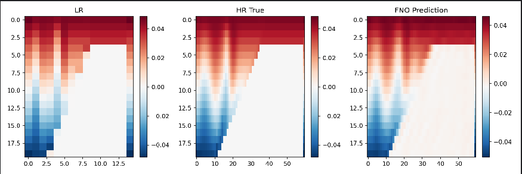

# 🌊 MITgcm 内波模拟 + FNO 超分辨率项目

## 📋 项目概述

本项目基于MITgcm内部波模拟数据，利用傅里叶神经算子（FNO）实现海洋温度场的超分辨率重建。通过将低分辨率输入映射到高分辨率输出，评估FNO在海洋物理场重建中的性能，为海洋数值模拟数据的后处理提供深度学习解决方案。

---

## 📁 项目结构

```
project/
│
├── MITgcm/verification/internal_wave/       # MITgcm 的 internal_wave 案例
│   ├── build/                               # 编译目录
│   ├── input/                               # 输入参数文件
│   └── run/                                 # 运行目录
│       ├── make_npz_MITgcm.py              # MITgcm 输出 → npz 数据预处理
│
├── FNO/                                     # FNO 模型目录
│   ├── mitgcm_dataset.py                   # FNO 专用数据集类
│   ├── train_fno_mitgcm.py                 # FNO 模型训练脚本
│
└── README.md                               # 项目说明文档
```

---

## 🧩 功能模块

1. **`make_npz_MITgcm.py`**：将MITgcm原始数据转换为低/高分辨率配对的训练数据集。

2. **`mitgcm_dataset.py`**：构建FNO专用的数据加载器，实现低分辨率到高分辨率的映射。

3. **`train_fno_mitgcm.py`**：训练FNO超分辨率模型，自动优化并评估模型性能。

---

## ⚙️ 一、环境配置

### 1. 编程环境要求

- **Python** ≥ 3.9
- **PyTorch** ≥ 1.10
- **CUDA** ≥ 11.0（推荐，用于GPU加速）

### 2. 安装依赖包

```bash
pip install numpy xarray netCDF4 matplotlib torch torchvision scipy MITgcmutils neuraloperator
```

### 3. 克隆FNO官方仓库

```bash
git clone https://github.com/zongyi-li/fourier_neural_operator.git
```

---

## 🌊 二、MITgcm内波模拟

### 2.1 获取MITgcm源码

```bash
git clone https://github.com/MITgcm/MITgcm.git
cd MITgcm/verification/internal_wave
```

### 2.2 编译MITgcm

```bash
cd build
../../../tools/genmake2 -mods=../code -of=YOUR_OPTFILE
make depend
make
```

**常见optfile选项：**
- `linux_amd64_gfortran`
- `linux_amd64_ifort`
- 其他系统请参考MITgcm下的README文件

### 2.3 配置输入参数

```bash
cd ../input
# 编辑data文件，进行以下关键配置：
```

在`data`文件中修改以下参数：

```
# 启用全局输出
globalFiles = .TRUE.

# 修改时间步设置，确保有足够的时间步数据
 &PARM03
 nIter0=0,
 nTimeSteps=300,
 deltaT=500.,
 abEps=0.1,
 pChkptFreq=0.,
 chkptFreq=0.,
 dumpFreq=5000.,   #控制数据输出频率
 monitorFreq=2500.,   #控制监控输出频率
 monitorSelect=2,
 &
```

### 2.4 运行模拟

```bash
cd ../run
ln -s ../input/* .
ln -s ../build/mitgcmuv .
./mitgcmuv > output.txt
```

**输出文件示例：**
- `T.000000xxxx.data / meta`（温度场）
- `U.000000xxxx.data / meta`（U速度场）
- `V.000000xxxx.data / meta`（V速度场）
- `Eta.000000xxxx.data / meta`（自由面高度）

---

## 🔧 三、完整运行流程

### 步骤1：在MITgcm运行目录生成npz数据

```bash
# 在当前run文件夹中生成npz数据集，下采样比例为4
python make_npz_MITgcm.py --scale 4 --out dataset

# 查看生成的数据集
ls dataset/
# 输出示例: T.0000000000_y000.npz, T.0000000010_y000.npz, ...
```

### 步骤2：创建FNO项目目录并复制数据

```bash
# 回到项目根目录
cd ../../../../..

# 复制数据集到FNO目录
cp -r MITgcm/verification/internal_wave/run/dataset FNO/
```

### 步骤3：在FNO目录中训练模型

```bash
# 进入FNO目录
cd FNO

# 运行训练脚本（使用GPU加速）
python train_fno_mitgcm.py
```

### 目录结构验证
训练前确保FNO目录结构如下：
```
FNO/
├── dataset/
│   ├── T.0000000000_y000.npz
│   ├── T.0000000010_y000.npz
│   └── ...
├── mitgcm_dataset.py
└── train_fno_mitgcm.py
```

---

## 🧮 四、技术实现细节

### 4.1 数据预处理流程

```python
# 在make_npz_MITgcm.py中
def resample_2d(HR, scale):
    """下采样nx方向"""
    nz, nx = HR.shape
    new_nx = max(1, nx // scale)
    LR = scipy.ndimage.zoom(HR, zoom=(1.0, new_nx / nx), order=3)
    return LR.astype(np.float32)

# 保存为npz格式
np.savez_compressed(outname, hr=HR.astype(np.float32), lr=LR.astype(np.float32))
```

### 4.2 数据集处理

```python
# 在mitgcm_dataset.py中
class MITgcmFNO(Dataset):
    def __getitem__(self, idx):
        d = np.load(self.files[idx])
        hr = d["hr"]  # 高分辨率数据
        lr = d["lr"]  # 低分辨率数据
        
        # 转换为Tensor并增加通道维度
        hr = torch.from_numpy(hr).float().unsqueeze(0)   # (1, nz, nx)
        lr = torch.from_numpy(lr).float().unsqueeze(0)   # (1, nz, nx//scale)
        
        # 双三次插值上采样到HR尺寸
        lr_up = F.interpolate(lr.unsqueeze(0), size=hr.shape[-2:], 
                             mode="bicubic", align_corners=False)
        lr_up = lr_up.squeeze(0)  # (1, nz, nx)
        
        return lr_up, hr, lr
```

### 4.3 FNO模型配置

```python
model = FNO(
    n_modes=(12, 12),           # 傅里叶模式数
    in_channels=1,              # 输入通道数
    out_channels=1,             # 输出通道数
    hidden_channels=64,         # 隐藏层通道数
    n_layers=4,                 # 网络层数
    positional_embedding="grid" # 位置编码方式
).to(device)
```

### 4.4 训练参数配置

- **损失函数**: `nn.MSELoss()`
- **优化器**: `torch.optim.Adam(model.parameters(), lr=1e-3)`
- **训练轮数**: 200 epochs
- **批大小**: 2
- **数据划分**: 训练集80%, 验证集10%, 测试集10%
- **设备**: 自动检测CUDA，支持GPU加速

---

## 📊 五、数据处理流程

### 5.1 数据生成流程

1. **MITgcm原始输出**：`T.0000000100.data/meta` 等二进制文件
2. **npz转换**：在`MITgcm/verification/internal_wave/run/`中运行`make_npz_MITgcm.py`
3. **数据集复制**：将生成的`dataset/`文件夹复制到`FNO/`目录
4. **模型训练**：在`FNO/`目录中运行训练脚本

### 5.2 数据格式说明

**每个npz文件包含：**
- `hr`：高分辨率数据（MITgcm原分辨率）
- `lr`：低分辨率数据（按scale下采样）

**典型数据形状：**
- HR: `(nz, nx)` - 例如 `(20, 60)`
- LR: `(nz, nx//scale)` - 例如 `(20, 15)`（当scale=4时）

---

## 📈 六、实验结果与分析

### 6.1 训练输出示例

```
Device = cuda
Dataset split: Train=24, Val=3, Test=4
[Epoch 001] Train=0.000510  Val=0.000220
  ✓ Saved best model  (val=0.000220)
[Epoch 002] Train=0.000178  Val=0.000143
  ✓ Saved best model  (val=0.000143)
...
[Epoch 200] Train=0.000004  Val=0.000005
训练完成。

============= Running TEST evaluation =============
★ Test Loss = 0.000005
测试评估完成，并已保存可视化与误差文件。
```

### 6.2 性能分析

训练性能指标

- **最终训练损失**: 0.000004
- **最终验证损失**: 0.000005  
- **测试损失**: 0.000005
- **最佳验证损失**: 0.000004（Epoch 197）

收敛过程分析

1. **快速收敛期**（Epoch 1-50）
   - 损失从0.000510迅速下降到0.000015
   - 下降幅度达97%，学习效率高

2. **稳定收敛期**（Epoch 50-150）
   - 损失缓慢下降至0.000005
   - 模型逐步优化细节特征

3. **收敛稳定期**（Epoch 150-200）
   - 损失在0.000004-0.000005间波动
   - 达到性能平台，训练充分

模型选择效果

- 共保存了**33次**最优模型
- 模型选择策略有效，能够持续跟踪最佳性能
- 最终测试损失与最佳验证损失高度一致

数据利用效率

- **总数据量**: 31个样本
- **训练集**: 24样本（77.4%）
- **验证集**: 3样本（9.7%）
- **测试集**: 4样本（12.9%）
- 在有限数据下仍表现出优秀的学习能力

误差水平评估

- 测试MSE: 0.000005
- 对应RMSE: ≈0.0022
- 考虑到温度场的典型数值范围（0-30°C），这是一个相当低的误差水平
- 表明FNO在海洋温度场超分辨率任务上具有出色表现

### 6.3 泛化能力评估

- 训练、验证、测试损失高度一致
- 三个数据集的损失差异极小
- 表明模型具有良好的泛化能力，未出现过拟合

---

## 🎯 七、输出文件说明

### 7.1 模型文件
- `fno_best.pth`：验证集性能最优的模型权重
- `fno_final.pth`：训练完成时的最终模型权重

### 7.2 可视化文件

包含LR输入、HR真值和FNO预测的三组对比

- `epochXXX_vis.png`：训练过程中的验证集可视化

- `test_X_vis.png`：测试集预测结果可视化

  

### 7.3 评估文件
- `test_metrics.txt`：测试集性能指标记录

---

## 📚 八、参考文献

[Marshall, J., Adcroft, A., Hill, C., Perelman, L., and Heisey, C. 1997. *A finite-volume, incompressible Navier Stokes model for studies of the ocean on parallel computers.* Journal of Geophysical Research: Oceans, 102(C3), 5753–5766.](https://doi.org/10.1029/96JC02775)

[Marshall, J., Hill, C., Perelman, L., and Adcroft, A. 1997. *Hydrostatic, quasi-hydrostatic, and nonhydrostatic ocean modeling.* Journal of Geophysical Research: Oceans, 102(C3), 5733–5752.](https://doi.org/10.1029/96JC02776)

[MITgcm Group and Contributors. *MITgcm: Massachusetts Institute of Technology General Circulation Model.*](https://github.com/MITgcm/MITgcm)

[Li, Z., Kovachki, N., Azizzadenesheli, K., Liu, B., Bhattacharya, K., Stuart, A., and Anandkumar, A. 2020. *Fourier Neural Operator for Parametric Partial Differential Equations.* In Proceedings of the 34th Conference on Neural Information Processing Systems (NeurIPS ’20).](https://arxiv.org/abs/2010.08895)

[Li, Z., Kovachki, N., and contributors. *Fourier Neural Operator (FNO) PyTorch Implementation.*](https://github.com/neuraloperator/neuraloperator)